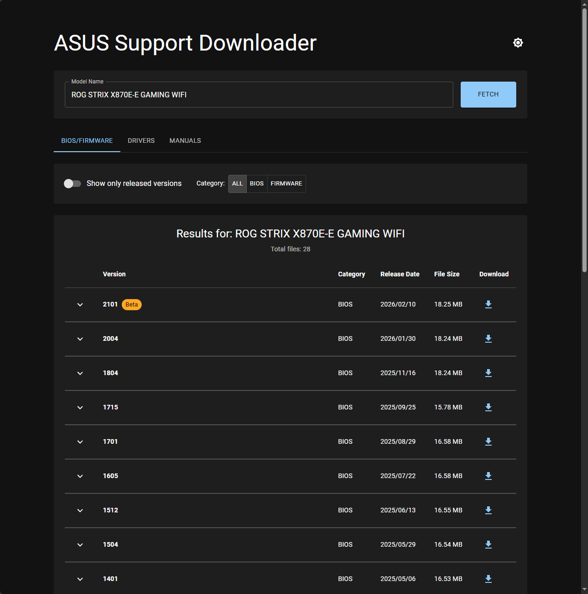
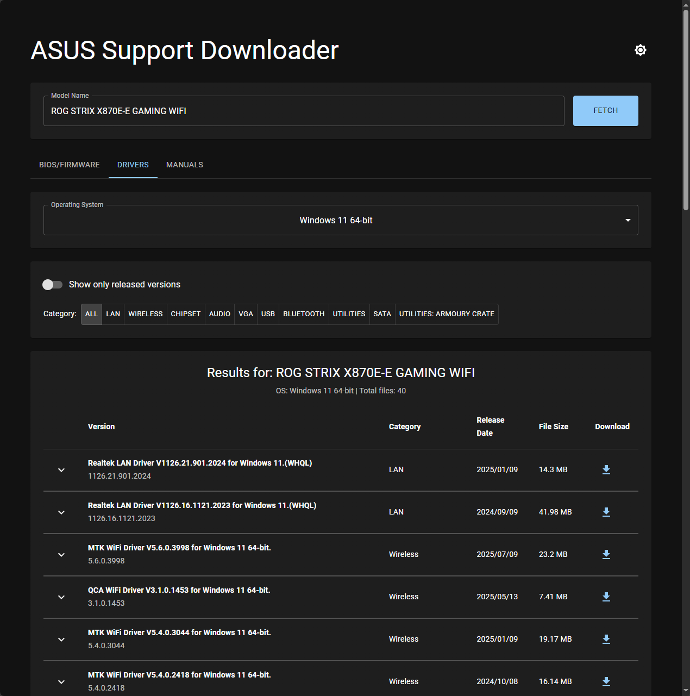
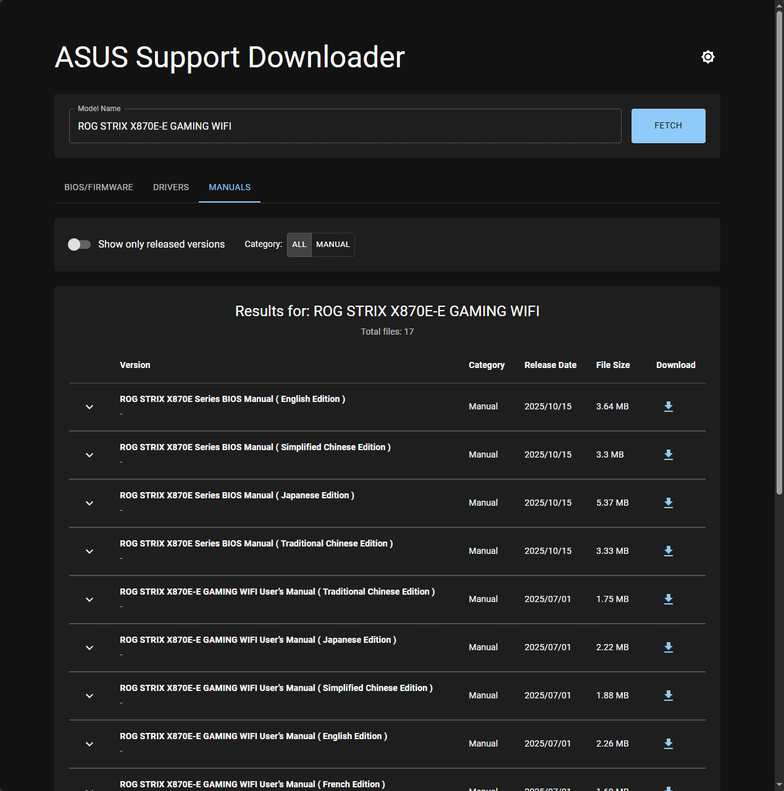

# ASUS Support Downloader

A web application that allows you to download BIOS updates, drivers, and manuals for ASUS products, particularly useful in regions where ASUS support pages are blocked due to legal restrictions.

## ⚠️ Disclaimer

**THIS SOFTWARE IS PROVIDED "AS-IS" WITHOUT WARRANTY OF ANY KIND, EXPRESS OR IMPLIED.**

- The author is NOT responsible for any damage to your hardware or software that may result from using this application or downloading files through it
- Use at your own risk
- Always verify downloaded files and follow manufacturer instructions when updating BIOS or installing drivers
- This application is an unofficial tool and is not affiliated with or endorsed by ASUS

## Background

This application was created to help users in countries like Germany access ASUS support downloads. [Due to a court ruling in a patent dispute with Nokia, ASUS was forced to block access to their support download pages in certain regions](https://press.asus.com/news/statements/public-statement-to-patent-dispute-with-nokia). This tool provides an alternative way to access these downloads by querying ASUS APIs directly.

## Features

- 🔧 **BIOS/Firmware Downloads** - Access all available BIOS updates
- 💾 **Driver Downloads** - Browse and download drivers by operating system
- 📖 **Manual Downloads** - Download product manuals in multiple languages
- 🌙 **Dark Mode** - Easy on the eyes
- 🔄 **Persistent State** - Switch between tabs without losing data
- 🎯 **Smart Filtering** - Filter by category and release status

## Screenshots

#### BIOS/Firmware Tab


#### Drivers Tab


#### Manuals Tab


## Installation & Setup

### Prerequisites

You need to have Node.js installed on your computer.

**Download Node.js:**
1. Visit [nodejs.org](https://nodejs.org/)
2. Download the "LTS" (Long Term Support) version
3. Run the installer and follow the prompts (keep all default settings)

### Getting Started

1. **Download this project**
   - Download the project as a ZIP file and extract it
   - Or if you know how to use Git: `git clone <repository-url>`

2. **Open a terminal/command prompt**
   - **Windows**: Press `Win + R`, type `cmd`, press Enter
   - **Mac/Linux**: Open Terminal from Applications

3. **Navigate to the project folder**
   ```bash
   cd path/to/asus-support
   ```
   Replace `path/to/asus-support` with the actual path where you extracted the files

4. **Install dependencies**

   This step downloads all the necessary files the application needs to run:
   ```bash
   npm install
   ```
   This may take a few minutes. Wait for it to complete.

5. **Start the application**
   ```bash
   npm run dev
   ```

6. **Open in your browser**

   After running the command, you'll see a message like:
   ```
   Local: http://localhost:5173/
   ```

   Open your web browser and go to: **http://localhost:5173/**

## Finding Your Motherboard Model

Before using this application, you need to know your ASUS motherboard's exact model name. Here's how to find it:

### Windows (PowerShell)

1. Press `Win + X` and select "Windows PowerShell" or "Terminal"
2. Run the following command:

```powershell
Get-CimInstance win32_baseboard
```
3. Copy the value from the `Product` field

**Example output:**
```
Manufacturer : ASUSTeK COMPUTER INC.
Model        :
Name         : Base Board
SerialNumber : ***************
SKU          :
Product      : ROG STRIX X870E-E GAMING WIFI
```

In this example, the model name is: **ROG STRIX X870E-E GAMING WIFI**

## How to Use

1. **Enter Your Model**
   - The model name "ROG STRIX X870E-E GAMING WIFI" is pre-filled as an example
   - Replace it with your actual motherboard model (see "Finding Your Motherboard Model" above)

2. **Click "Fetch"**
   - This will load the available downloads for your model

3. **Choose What You Need**
   - **BIOS/Firmware tab**: BIOS updates and firmware
   - **Drivers tab**: Select your operating system (e.g., Windows 11 64-bit) and browse drivers
   - **Manuals tab**: Product manuals and documentation

4. **Download Files**
   - Click the download icon (⬇️) to download a file
   - Or click the arrow (▼) to expand and see more details
   - Files will download directly to your browser's download folder

## Troubleshooting

**"npm is not recognized"**
- Node.js is not installed or not in your PATH
- Restart your computer after installing Node.js

**Downloads fail with 403 error**
- This is normal on the first attempt
- The browser will open a new tab - click the URL bar and press Enter again

**No data appears after clicking Fetch**
- Check that you entered the model name correctly
- Make sure you have an internet connection
- Some models may not have downloads available

## Deployment

⚠️ **Note**: Deployment to Vercel and Netlify has not been tested. The serverless functions in the `/api` directory and the configuration files (`vercel.json`, `netlify.toml`) are provided as a starting point but should be taken with a grain of salt. You may need to adjust them for your specific deployment needs.

This app can be deployed to static hosting platforms like:

- **Vercel**: `vercel deploy`
- **Netlify**: `netlify deploy`

The serverless functions in the `/api` directory are intended to work with these platforms, but may require additional configuration.

## Technical Details

For developers:

- **Frontend**: React 19 + Vite
- **UI Framework**: Material-UI (MUI)
- **Routing**: React Router v7
- **State Management**: React Context API
- **HTTP Client**: Axios
- **API**: ASUS Support API (proxied through Vite dev server or serverless functions)

## License

This project is provided as-is for educational and personal use. The author takes no responsibility for any consequences of using this software.

## Support

This is an unofficial, community-driven project. For official ASUS support, please contact ASUS directly in your region (where legally available).
